# Architecture Diagrams

## 1. Architecture Comparison: Microsoft CoreAI vs MEA

### Microsoft CoreAI Approach (Heavy Integration)

```mermaid
graph TB
    User[👤 User Input] --> CoreAI[🏢 Microsoft CoreAI<br/>Massive Integrated Model<br/>GPU Clusters Required]
    CoreAI --> Cloud[☁️ Azure Cloud Processing]
    Cloud --> Response[📤 Response]
    
    style CoreAI fill:#ff6b6b,stroke:#000,stroke-width:3px
    style Cloud fill:#ffb3b3,stroke:#000
    style User fill:#e1f5fe
    style Response fill:#e1f5fe
```

### MEA Approach (Lightweight Separation)

```mermaid
graph TB
    User[👤 User Input] --> Core[🧠 Motivation Core<br/>Lightweight Local<br/>CPU Only]
    Core --> Decision{🎯 Action Score<br/>Calculation}
    
    Decision -->|High Intent| Search[🔍 Web Search Plugin]
    Decision -->|Need Generation| LLM[🤖 LLM Plugin<br/>GPT/Claude/etc]
    Decision -->|Local Data| Knowledge[📚 Local Knowledge]
    
    Search --> Integrate[🔧 Result Integration]
    LLM --> Integrate
    Knowledge --> Integrate
    Integrate --> Response[📤 Response]
    
    style Core fill:#4ecdc4,stroke:#000,stroke-width:2px
    style Decision fill:#45b7d1,stroke:#000
    style Search fill:#96ceb4
    style LLM fill:#96ceb4
    style Knowledge fill:#96ceb4
    style Integrate fill:#feca57
    style User fill:#e1f5fe
    style Response fill:#e1f5fe
```

## 2. Cost & Efficiency Comparison

## 3. MEA Process Flow

```mermaid
sequenceDiagram
    participant U as 👤 User
    participant MC as 🧠 Motivation Core
    participant WS as 🔍 Web Search
    participant LLM as 🤖 LLM Plugin
    participant LK as 📚 Local Knowledge
    
    U->>MC: "Prepare presentation on renewable energy"
    
    Note over MC: Calculate Action Scores:<br/>W_intent×0.9 + W_novelty×0.6 - W_cost×0.3
    
    MC->>WS: G-SEARCH: "renewable energy trends 2025"
    WS-->>MC: Latest statistics & data
    
    Note over MC: Good data received<br/>Now need synthesis
    
    MC->>LLM: G-GENERATE: "Create structured outline"
    LLM-->>MC: Formatted presentation outline
    
    MC->>U: 📊 Complete presentation with sources
    
    U->>MC: "Perfect! Exactly what I needed ✅"
    
    Note over MC: Update weights:<br/>W_intent ↑ (good task completion)<br/>W_cost ↓ (willing to spend for quality)
```

## 4. Learning & Adaptation Process

```mermaid
graph TB
    Input[📝 User Input] --> Analysis[🧠 Intention Analysis]
    Analysis --> Score[📊 Action Scoring]
    
    Score --> Action1[🔍 Search]
    Score --> Action2[🤖 Generate] 
    Score --> Action3[📚 Local Query]
    
    Action1 --> Result[📤 Response]
    Action2 --> Result
    Action3 --> Result
    
    Result --> Feedback{👤 User Feedback}
    Feedback -->|😊 Positive| WeightUp[⬆️ Strengthen Used Weights]
    Feedback -->|😞 Negative| WeightDown[⬇️ Weaken Used Weights]
    
    WeightUp --> Update[🔄 Update Model]
    WeightDown --> Update
    Update --> Analysis
    
    style Analysis fill:#4ecdc4
    style Score fill:#45b7d1
    style Result fill:#feca57
    style Update fill:#96ceb4
```

## 5. Privacy & Data Flow Comparison

```mermaid
graph TB
    subgraph Cloud["☁️ Traditional Cloud AI"]
        CU[👤 User] --> CUpload[📤 Upload Data]
        CUpload --> CProcess[🏢 Cloud Processing]
        CProcess --> CStore[💾 Data Storage]
        CStore --> CAnalyze[📊 Analytics/Training]
        CAnalyze --> CRisk[⚠️ Privacy Risk]
    end
    
    subgraph Local["🏠 MEA Local-First"]
        LU[👤 User] --> LCore[🧠 Local Core]
        LCore --> LDecision{Need External?}
        LDecision -->|Yes| LPlugin[🔌 Targeted Query Only]
        LDecision -->|No| LResponse[📱 Local Response]
        LPlugin --> LResponse
        LResponse --> LSafe[🔒 Data Stays Local]
    end
    
    style CUpload fill:#ff6b6b
    style CProcess fill:#ff6b6b
    style CStore fill:#ff6b6b
    style CAnalyze fill:#ff6b6b
    style CRisk fill:#ff6b6b
    
    style LCore fill:#4ecdc4
    style LDecision fill:#45b7d1
    style LPlugin fill:#96ceb4
    style LResponse fill:#96ceb4
    style LSafe fill:#4ecdc4
```

